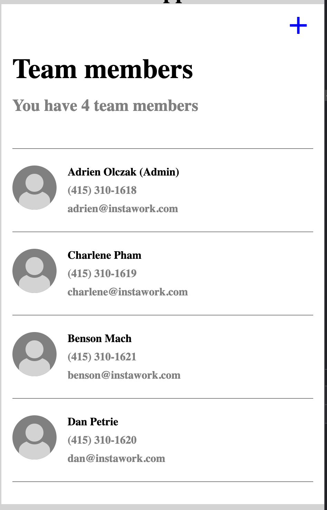
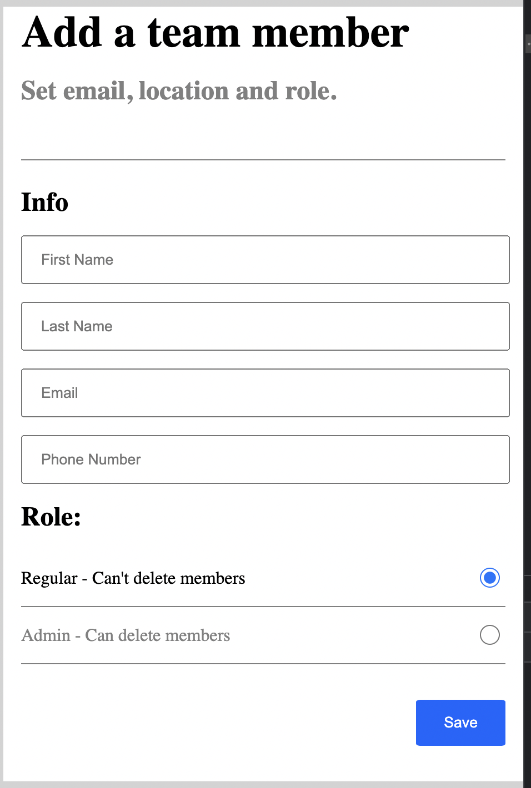
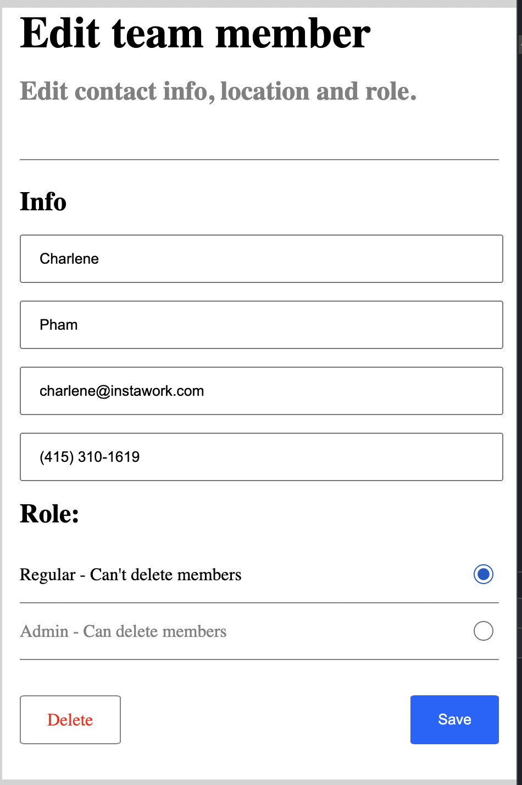
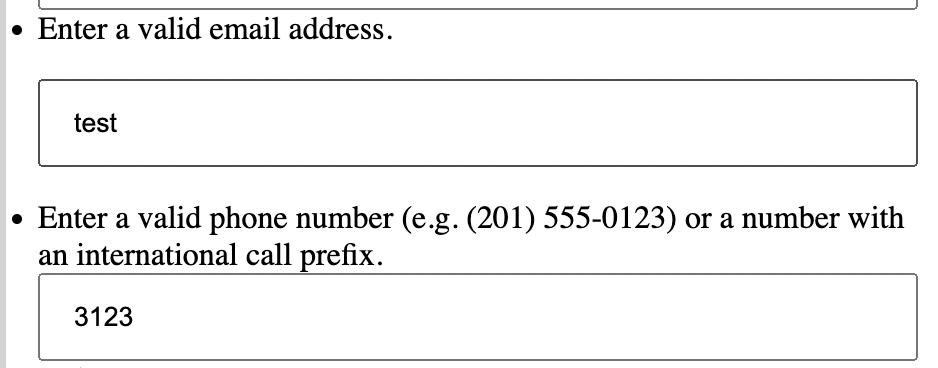

# Instawork Django Assessment  

 

# App Description 

 

A simple team-member management application that allow the user to view, edit, add, and delete team members. The app consists of 3 pages. 

 

<<<<<<< HEAD
<div align="center">
  
   
  
</div>
=======
<p float="left" align="middle">
  
   
  
</p>
>>>>>>> 9ecbc16b15912b31a77c7968265c8a2625c0a0f6

  

Estimated time spent: ~14 hours 

 

## Requirements  

 
<<<<<<< HEAD
=======

>>>>>>> 9ecbc16b15912b31a77c7968265c8a2625c0a0f6
Python3 

https://www.python.org/downloads/ 

Pip3  

https://www.geeksforgeeks.org/how-to-install-pip-in-macos/ 

 
<<<<<<< HEAD
=======

>>>>>>> 9ecbc16b15912b31a77c7968265c8a2625c0a0f6
 

## Setup 

 

Clone the project, open a new terminal & cd into your directory 

 

```cd Instawork-Django-Assessment``` 

 

Create a virtual environment  

 

```python3 –m venv venv``` 

 

Enable the virtual environment  

 

```source venv/bin/activate```  

 

Install Django 

 

```python3 –m pip install Django``` 

 

Install the following modules  

 

``` 

pip install django-db-logger 

pip install django-phonenumber-field 

pip install django-phonenumbers 

pip install django-multiselectfield 

 

``` 

Lastly 

 

```Python3 manage.py runserver```  

 

Click on the port link to run the application 

 

## Testing 

 

### Home Page 

<<<<<<< HEAD

=======

>>>>>>> 9ecbc16b15912b31a77c7968265c8a2625c0a0f6


On the home page, click on the plus sign at the top right to direct you to the Add Page.  


Click on any of the listed members to be directed to its edit page. 

### Add Page  

<<<<<<< HEAD
  
=======
  
>>>>>>> 9ecbc16b15912b31a77c7968265c8a2625c0a0f6


Clicking save before filling out the form completely should throw a message 'Please fill out this field' for the fields that are blank. 

Fill the form completely with invalid formatting for email and phone number. Clicking save should result in the following messages. 


 

Re-enter the fields with a valid email and phone number and click save. This should redirect you back to the home page.  

 

On the home page, you should see the newly created member at the bottom of the list. The sub-heading at the top should say 'You have 5 team members', reflecting the actual amount of members being listed.  

 

Go back to the Add page and fill in the form with valid information. This time, select Admin under 'Role' and click Save. On the bottom of the home page, you should see the newly created member with an '(Admin)' attached to the right of the member's name.  

 

### Edit Page  


Similar to the Add page, clicking Save with empty fields will result in error messages that prevent the edit from taking place. 


Fill in the form with valid information. Select Admin under 'Role' and click Save. On the bottom of the home page, you should see the edited member with an '(Admin)' attached to the right of the member's name. 


Go back to an Edit page. Clicking Delete will redirect you back to the home page and you should no longer see the deleted team member in the list.  

 

 

 

 

 

 

 

<<<<<<< HEAD
 
=======
 
>>>>>>> 9ecbc16b15912b31a77c7968265c8a2625c0a0f6
